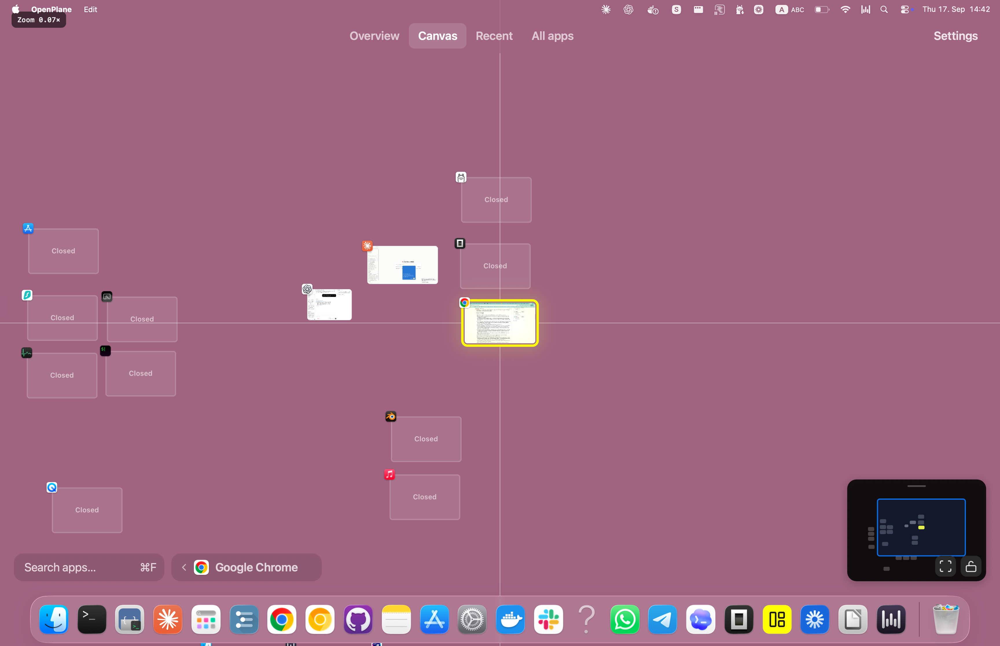

# OpenPlane

**A zoomable map of your Mac's windows.** Arrange apps where you remember them,
see window previews, and jump back into work with a click or the keyboard.
Useful when you have many windows open and want a visual way to find your place.

## At a glance

- **Started:** September 2, 2026, by Arash Yalpani.
- **Status:** experimental native macOS app, version 0.1.
- **Platform:** macOS 26 or later; currently focused on the main display and current Space.
- **Four views:** Canvas for free placement, Overview for grouped windows,
  Recent for window history, and All apps for launching apps.

## What you can do

Pan and zoom, arrange windows in groups, search apps, and navigate with the
keyboard. A minimap helps you keep your bearings. App positions persist, even
when an app is closed. Spotlight, the Dock, and normal macOS windows still work
as usual.

Press **Control–Option–Space** to open OpenPlane, use **arrow keys** to navigate,
and press **Return** to activate a window.

## Built with

- **Swift 6 and AppKit** for the native interface.
- **Core Animation** for the zoomable canvas and animations.
- **ScreenCaptureKit and macOS Accessibility APIs** for window previews and control.
- **XCTest** for automated tests; **Python and JavaScript** for performance tooling.
- Optional **OpenAI API** experiment for suggesting view settings from a prompt;
  requires your own key. Normal window navigation does not need it.

## Try it

Open `OpenPlane.xcodeproj` in Xcode, select your signing team, and build the
**OpenPlane** scheme. For regular use, build Release and copy `OpenPlane.app`
to `/Applications`. Grant **Screen Recording** and **Accessibility** access
when prompted.

## More

[Performance policy](docs/performance/policy.md) ·
[Test runbooks](docs/performance/runbooks.md) ·
[Known verification gaps](docs/performance/backlog.md) ·
[Review Desk](review-desk/README.md)

[MIT License](LICENSE). The Lucide-derived app icon uses the ISC license;
see [third-party notices](THIRD_PARTY_NOTICES.md).
